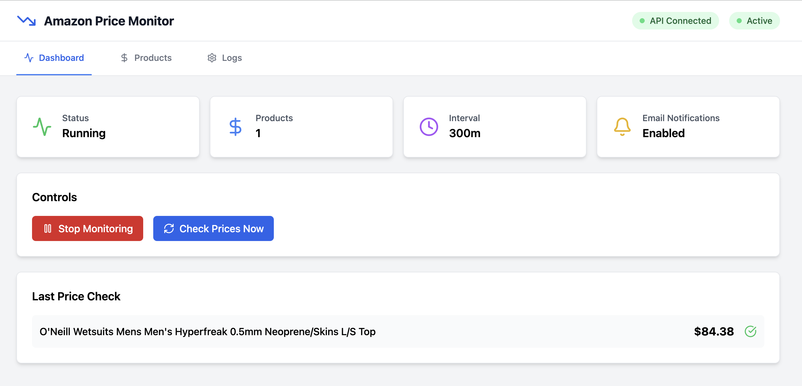
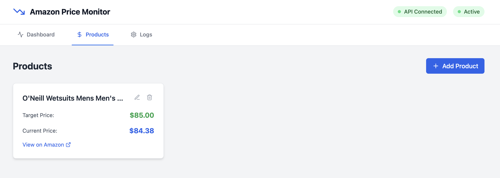
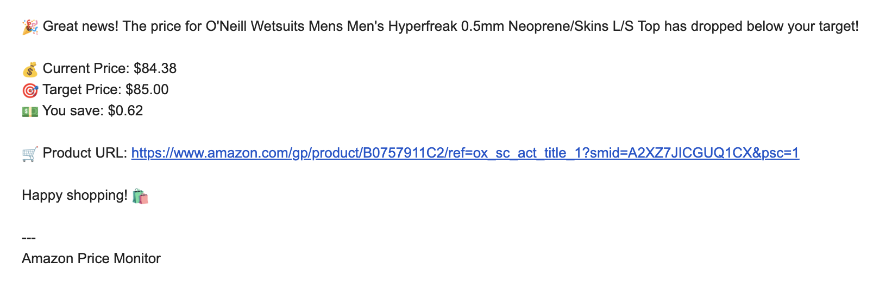

# 🛒 Amazon Price Monitor

A Python application that monitors Amazon product prices and sends notifications when prices drop below your target thresholds. Built with Crawl4AI for reliable price extraction and supports multiple notification methods.







## ✨ Features

- **Smart Price Extraction**:  Crawl4AI for Amazon price scraping
- **Notification**: email alerts
- **Price History Tracking**: Maintains historical price data with timestamps
- **Continuous Monitoring**: Runs in background with configurable check intervals
- **Docker Support**: Ready-to-run Docker container for Raspberry Pi and other platforms



## 🚀 Quick Start

## Create .env file with:

# Email Notifications
SMTP_SENDER_EMAIL=
SMTP_SENDER_PASSWORD=
SMTP_RECIPIENT_EMAIL=
SMTP_SERVER=smtp.gmail.com
SMTP_PORT=587

## On RasPi
```bash
hostname -I  # On the Pi
```
# Or check your router's device list

### Local Installation

1. **Clone and setup:**
```bash
git clone <your-repo-url>
cd amazon-price-monitor
python -m venv venv
source venv/bin/activate  # On Windows: venv\Scripts\activate
```

2. **Install dependencies:**
```bash
pip install -r requirements.txt
playwright install
```

3. **Configure your products:**
```bash
cp config.example.json config.json
# Edit config.json with your product URLs and notification settings
```

4. **Run the monitor:**
```bash
python amazon_price_monitor.py
```

### Docker Installation (Recommended for Raspberry Pi)

1. **Setup:**
```bash
chmod +x setup-pi.sh
./setup-pi.sh
```

2. **Configure and run:**
```bash
# Edit config.json with your settings
docker-compose up -d
```

3. **Monitor logs:**
```bash
docker-compose logs -f
```

## ⚙️ Configuration

Edit `config.json` to customize your monitoring:

```json
{
    "products": [
        {
            "name": "Product Name",
            "url": "https://www.amazon.com/gp/product/B0XXXXXXXX/",
            "target_price": 50.00
        }
    ],
    "check_interval_minutes": 60,
    "email_notifications": {
        "enabled": true
    }
}
```

### 📧 Email Setup (Gmail)

For Gmail notifications:

1. Enable 2-Factor Authentication
2. Generate an [App Password](https://support.google.com/accounts/answer/185833)
3. Use the app password (not your regular password) in `config.json`

### 🔔 Notification Types

- **Email Alerts**: SMTP email notifications

## 📁 Project Structure

```
amazon-price-monitor/
├── README.md
├── .env.example
├── .env                    # Your actual environment variables
├── .gitignore
├── requirements.txt
├── docker-compose.yml
├── Dockerfile
├── setup.py               # Package setup
│
├── app/                   # Main application package
│   ├── __init__.py
│   ├── main.py           # FastAPI app entry point
│   ├── config.py         # Configuration management
│   ├── dependencies.py   # FastAPI dependencies
│   │
│   ├── api/              # API routes
│   │   ├── __init__.py
│   │   ├── deps.py       # API dependencies
│   │   └── v1/           # API version 1
│   │       ├── __init__.py
│   │       ├── api.py    # Main API router
│   │       └── endpoints/
│   │           ├── __init__.py
│   │           ├── products.py
│   │           ├── monitoring.py
│   │           └── status.py
│   │
│   ├── core/             # Core business logic
│   │   ├── __init__.py
│   │   ├── config.py     # Settings and configuration
│   │   ├── security.py   # Security utilities
│   │   └── logging.py    # Logging configuration
│   │
│   ├── models/           # Pydantic models
│   │   ├── __init__.py
│   │   ├── product.py
│   │   ├── monitoring.py
│   │   └──
│   │
│   ├── services/         # Business logic services
│   │   ├── __init__.py
│   │   ├── price_monitor.py    # Main monitoring service
│   │   ├── notification.py     # Notification service
│   │   └── price_extractor.py  # Price extraction service
│   │
│   └── utils/            # Utility functions
│       ├── __init__.py
│       ├── 
│       └── exceptions.py
│
├── frontend/             # React frontend
│   ├── public/
│   ├── src/
│   ├── package.json
│   └── ...
│
├── tests/                # Test files
│   ├── __init__.py
│   ├── conftest.py
│   ├── test_api/
│   ├── test_services/
│   └── test_utils/
│
├── scripts/              # Utility scripts
│   ├── 
│   ├── 
│   └── 
│
├── data/                 # Data directory
│   ├── config.json
│   ├── price_history.json
│   └── logs/
│       └── app.log
│
└── docs/                 # Documentation
    ├── 
    ├── 
    └── 
```

## 🐳 Docker Deployment

Perfect for running 24/7 on a Raspberry Pi or server:

### Build and Run
```bash
# Build image
docker-compose build

# Run in background
docker-compose up -d

# View logs
docker-compose logs -f

# Stop
docker-compose down
```

### Raspberry Pi Considerations

- Use email notifications instead of desktop notifications
- Consider longer check intervals (2-4 hours) to reduce load
- Monitor resource usage: `docker stats`
- Logs are persistent in `./logs/` directory

## 📊 Monitoring & Logs

### Log Files
- **Application logs**: `price_monitor.log`
- **Price history**: `price_history.json`
- **Docker logs**: `docker-compose logs`

### Health Checks
```bash
# Check if container is healthy
docker-compose ps

# View resource usage
docker stats

# Follow live logs
docker-compose logs -f amazon-price-monitor
```

## 🔧 Advanced Usage

### Multiple Products
Add multiple products to monitor in `config.json`:
```json
"products": [
    {
        "name": "Echo Dot",
        "url": "https://amazon.com/dp/B0757911C2",
        "target_price": 30.00
    },
    {
        "name": "iPad",
        "url": "https://amazon.com/dp/B09G9FPHY6",
        "target_price": 300.00
    }
]
```

### Custom Check Intervals
```json
"check_interval_minutes": 120  // Check every 2 hours
```


## 🛠️ Troubleshooting

### Common Issues

**Playwright Browser Error:**
```bash
playwright install
```

**Permission Denied (Docker):**
```bash
sudo usermod -aG docker $USER
# Log out and back in
```

**Price Extraction Fails:**
- Check if Amazon URL is accessible
- Verify product page format hasn't changed
- Check logs for specific error messages

**Email Notifications Not Working:**
- Verify SMTP settings
- Use app passwords for Gmail
- Check firewall settings

### Debug Mode
Add verbose logging:
```python
logging.basicConfig(level=logging.DEBUG)
```

## 📈 Performance Tips

- **Check Intervals**: Don't check too frequently (Amazon may block)
- **Resource Monitoring**: Use `docker stats` to monitor usage
- **Log Rotation**: Implement log rotation for long-running instances
- **Multiple Instances**: Run separate containers for different product categories

## 🤝 Contributing

1. Fork the repository
2. Create a feature branch
3. Make your changes
4. Add tests if applicable
5. Submit a pull request

## 📜 License

This project is licensed under the MIT License - see the [LICENSE](LICENSE) file for details.

## ⚠️ Disclaimer

This tool is for personal use only. Please respect Amazon's terms of service and robots.txt. Don't overload their servers with too frequent requests.

---

**Happy deal hunting! 🎯**